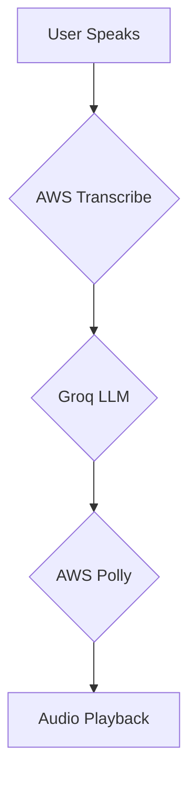

# Real-Time AI Medical Assistant

This project is a high-performance, real-time AI medical assistant that provides conversational medical advice. It leverages a powerful stack of cloud services to deliver an experience with latency as low as 300ms, rivaling platforms like ElevenLabs Conversational AI.

The application captures audio from the user's microphone, transcribes it to text in real-time, generates an intelligent response from a large language model, and synthesizes that response back into voice audio for the user.

## ✨ Features

-   **Live Transcription**: Utilizes **AWS Transcribe** for accurate, real-time speech-to-text.
-   **Intelligent Responses**: Powered by **Groq** using the cutting-edge `Llama-3.1-8B-Instant` model for fast and relevant medical advice.
-   **Real-Time Text-to-Speech**: Employs **AWS Polly** to generate natural-sounding voice responses with minimal delay.
-   **Conversational Memory**: Maintains a short-term memory of the conversation to provide context-aware answers.
-   **Extremely Low Latency**: Engineered for a rapid, seamless conversational flow.
-   **Simple GUI**: A straightforward Tkinter interface to start and stop the application.
-   **Voice-Activated Session Control**: Users can end the conversation naturally by saying "end the call" or similar phrases.

## ⚙️ How It Works

The application follows a simple, efficient pipeline:



## 📋 Prerequisites

-   Python 3.7+
-   An [AWS Account](https://aws.amazon.com/) with permissions for `transcribe:StartStreamTranscription` and `polly:SynthesizeSpeech`.
-   A [Groq Cloud Account](https://console.groq.com/keys) and API Key.
-   For some operating systems, you may need to install PortAudio, a dependency for `sounddevice`.
    -   On macOS: `brew install portaudio`
    -   On Debian/Ubuntu: `sudo apt-get install libasound-dev portaudio19-dev libportaudio2 libportaudiocpp0`

## 🚀 Installation

1.  **Clone the repository:**
    ```bash
    git clone https://github.com/Zeeshan-Hamid/Synapse-AI--Conversational-agent
    
    ```

2.  **Create and activate a virtual environment (recommended):**
    ```bash
    python -m venv venv
    # On Windows
    venv\Scripts\activate
    # On macOS/Linux
    source venv/bin/activate
    ```

3.  **Install the required packages:**
    ```bash
    pip install -r requirements.txt
    ```

## 🛠️ Configuration

The application requires API keys for Groq and AWS. While the `main.py` script contains hardcoded values for demonstration, the recommended approach is to use environment variables.

1.  **Groq API Key**:
    Set an environment variable named `GROQ_API_KEY`.
    ```bash
    # On Windows (Command Prompt)
    set GROQ_API_KEY="your_groq_api_key"

    # On macOS/Linux
    export GROQ_API_KEY="your_groq_api_key"
    ```

2.  **AWS Credentials**:
    Configure your AWS credentials as environment variables.
    ```bash
    # On Windows (Command Prompt)
    set AWS_ACCESS_KEY_ID="your_aws_access_key"
    set AWS_SECRET_ACCESS_KEY="your_aws_secret_key"
    set AWS_DEFAULT_REGION="us-east-1"

    # On macOS/Linux
    export AWS_ACCESS_KEY_ID="your_aws_access_key"
    export AWS_SECRET_ACCESS_KEY="your_aws_secret_key"
    export AWS_DEFAULT_REGION="us-east-1"
    ```
    Alternatively, you can configure them using the AWS CLI with `aws configure`.

## ▶️ Usage

1.  **Run the application:**
    ```bash
    python main.py
    ```

2.  **Start Transcribing**:
    A small window will appear with a "Start Transcribing" button. Click it to begin the session.

3.  **Interact with the Assistant**:
    Start speaking. The application will listen, process your words, and respond audibly.

4.  **End the Session**:
    To stop, you can either close the window or say a phrase like "end the call." A confirmation message will appear, and the application will close.

## 💻 Technology Stack

-   **Transcription**: `amazon-transcribe-streaming-sdk`
-   **Language Model**: `groq`
-   **Text-to-Speech**: `boto3` (for AWS Polly)
-   **Audio I/O**: `sounddevice`, `pygame`
-   **GUI**: `tkinter`
-   **Concurrency**: `asyncio`, `threading` 
